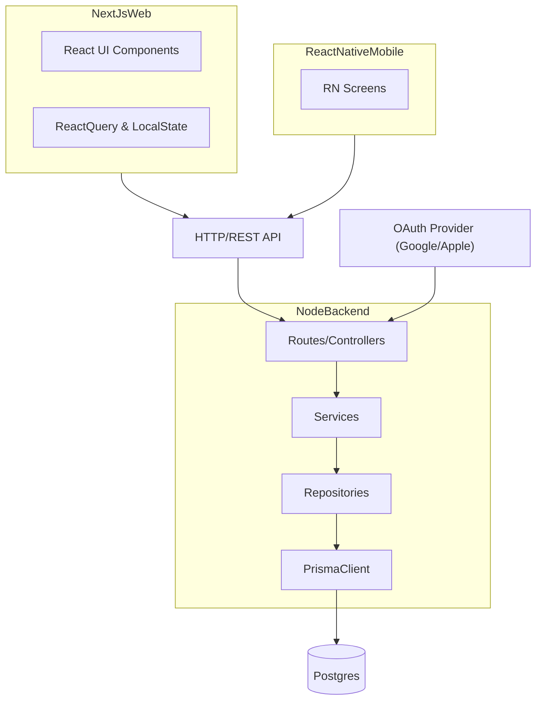

### Overview

We will build a **shared backend API** and a **web frontend** first, with the architecture and components designed so that a **React Native / Expo mobile app** can be added later with minimal backend changes. You will mainly provide **design and UX specs**, and I will handle backend structure and most implementation details.

### Tech Stack

- **Backend**
  - **Language/Framework**: Node.js with **Express** or **NestJS** (lean REST API, clear modules)
  - **Database**: PostgreSQL using **Prisma ORM** for a clean, type-safe schema
  - **Auth**: OAuth (Google and Apple) plus optional email/password via a provider like **NextAuth** (if using Next.js) or **Auth0 / custom JWT** for a pure API
  - **API Style**: REST with simple, predictable routes (`/api/budgets`, `/api/transactions`, etc.)
  - **Structure**: Layered: **routes/controllers → services → repositories → Prisma models** for easy maintenance
- **Frontend (phase 1: web)**
  - **Framework**: React with **Next.js** (for routing, SSR, and easy auth integration)
  - **Styling**: Tailwind CSS or CSS modules for quick iteration on ADHD-friendly UI
  - **State**: React Query (for server state) + simple local component state
  - **Design principles**: large tap targets, minimal text, color-coded categories, progressive disclosure, very few fields at once
- **Frontend (phase 2: mobile)**
  - React Native / Expo with UI and flows mirroring the web version
  - Reuse API endpoints and data models from backend

### Core Features & Data Model

- **Core entities**
  - **User**: auth info and preferences (currency, ADHD-friendly settings like "simplified mode")
  - **Account**: cash, bank, card, etc. with current balance
  - **Category**: color, icon, name, type (income/expense), and ordering for simple visual layout
  - **Budget**: monthly or custom-period budgets, per category and/or per account
  - **Transaction**: amount, date, account, category, notes (optional, not required to add quickly)
  - **Goal**: optional savings goals (e.g., "Emergency fund", target amount)
- **Backend schema and relations** (in `[backend/prisma/schema.prisma](backend/prisma/schema.prisma)`)
  - `User` 1–N `Account`
  - `User` 1–N `Category`
  - `User` 1–N `Budget`
  - `Account` 1–N `Transaction`
  - `Category` 1–N `Transaction`
- **Minimal MVP feature set**
  - Onboarding with **very few steps**: currency selection, 1–2 default accounts, basic categories
  - Quick-add expense/income with 2–3 taps: amount → category → account (defaults prefilled)
  - Monthly budget overview: clear traffic-light style (under, near, over budget)
  - Simple history list and daily/weekly summary chips

### ADHD-Friendly UX Principles to Bake In

- **Low cognitive load**
  - Show **one main decision per screen** where possible
  - Use **defaults** (e.g., default account, default time frame) so users can log an expense in under 5 seconds
  - Hide advanced filters behind a single "More" button
- **Visual clarity**
  - Strong contrast, large fonts, clear headings, and consistent primary/secondary actions
  - Color-coded categories and budgets (e.g., green/amber/red) with minimal text
- **Error & distraction handling**
  - If the user abandons a form, autosave partially completed entries when possible
  - Gentle reminders instead of intrusive modal dialogs

### High-Level Architecture

### Backend Implementation Plan

- **Step 1: Bootstrap backend project**
  - Create `[backend/package.json](backend/package.json)` with Express/NestJS, Prisma, and basic scripts (`dev`, `migrate`, `seed`)
  - Initialize `[backend/prisma/schema.prisma](backend/prisma/schema.prisma)` with `User`, `Account`, `Category`, `Budget`, `Transaction`, `Goal`
  - Configure `.env` for database URL
- **Step 2: Auth & user management**
  - Implement OAuth-based login endpoints and user creation/lookup
  - Issue JWT or session-based tokens that frontend can store securely
  - Add middleware to attach current user to the request context for all `/api/`* routes
- **Step 3: Core budget APIs** (initial versions)
  - `POST /api/accounts`, `GET /api/accounts`
  - `POST /api/categories`, `GET /api/categories`
  - `POST /api/transactions`, `GET /api/transactions` with simple filters (date range, account)
  - `GET /api/summary/monthly` returning category totals and budget status indicators
- **Step 4: ADHD-friendly helpers in API**
  - Quick-add endpoints with sane defaults (e.g., `POST /api/quick/expense` that uses last account and current date if not provided)
  - Endpoints that return **pre-grouped data** (e.g., grouped by week, by category) so the frontend can stay visually simple

### Frontend Implementation Plan (Web First)

- **Step 1: Bootstrap Next.js app**
  - Create `[frontend/package.json](frontend/package.json)` with Next.js, React, Tailwind
  - Basic layout: top-level layout with consistent header and content area
- **Step 2: Global design system**
  - Define tokens and utility classes for: font sizes, spacing, colors, buttons, cards
  - Build base components: `Button`, `Card`, `Input`, `NumberPad`, `Chip`
- **Step 3: Core screens**
  - **Onboarding flow**: pick currency, create first account, accept default categories
  - **Home dashboard**: today/this week spending, quick-entry CTA, top 3 budgets status
  - **Quick-add transaction**: accessible from everywhere, designed as a bottom sheet or center modal with large, clear buttons
  - **Budgets screen**: list budgets, color-coded progress bars
  - **History screen**: simple list, filters collapsed by default
- **Step 4: Auth integration**
  - Set up OAuth login using chosen provider (e.g., NextAuth) pointing to backend
  - Protect authenticated pages; redirect unauthenticated users to a friendly login splash
- **Step 5: Polish for ADHD usability**
  - Iterate on spacing, font sizes, colors according to your design specs
  - Add optional reminders or nudges (e.g., "You haven’t logged anything today") in a non-intrusive banner

### Future: Mobile App

- After the web app is stable:
  - Create an Expo project mirroring routes: Home, Quick-Add, Budgets, History
  - Reuse API calls, data structures, and logic
  - Adapt layout for thumbs and 1-handed use (bottom navigation, big FAB for quick-add)

### How We’ll Collaborate

- You mainly provide:
  - Color palettes, spacing preferences, and layout sketches/wireframes
  - Copy tone (e.g., very casual, neutral, clinical)
- I will:
  - Design and implement backend models, services, and APIs
  - Implement the frontend screens and components, following your visual specs
  - Propose UX simplifications when something can be made easier for ADHD users

