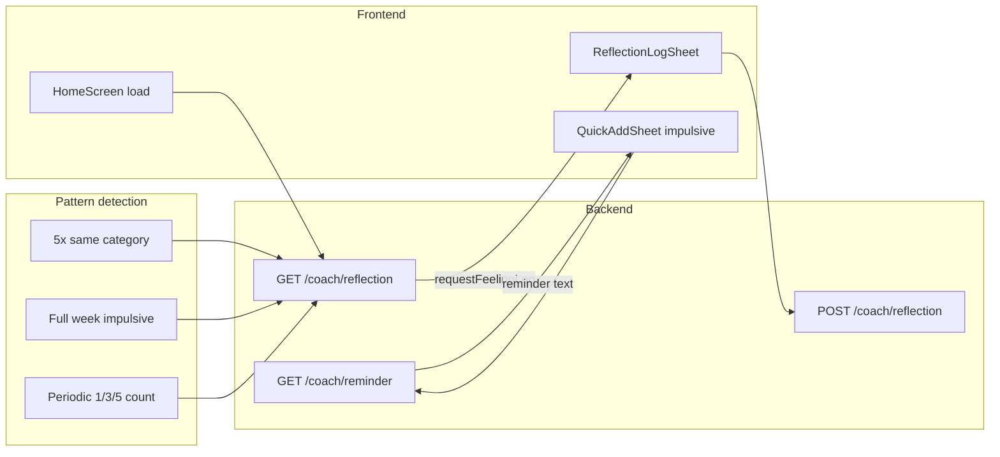

# Reflection prompts, pattern detection, and reminders

## Current state

- **Transactions** already have `spendType` (PLANNED / IMPULSIVE) and `categoryId` ([schema](backend/prisma/schema.prisma)).
- **Coach** exists but is minimal: [backend/src/services/coach.ts](backend/src/services/coach.ts) returns a single text prompt based on impulsive counts (1 today, 3 or 5 this week) and records it in `CoachPrompt` so it is not shown again. No per-category logic.
- **Frontend** does not call the real coach API; [HomeScreen](frontend/src/components/HomeScreen.tsx) only shows a mock message in "Preview notifications" mode. [ReflectionsMockupSheet](frontend/src/components/ReflectionsMockupSheet.tsx) is a static mockup with example feeling options and reminder copy.
- There is **no storage** of user feelings or reasons; only which prompt was shown is stored.

## Target behavior

1. **Periodic / pattern-based prompts**
  From time to time, or when patterns are detected, prompt: “How did you feel about this spending?” and “Why did you do it?” using **fixed category buttons only** (no free-text typing).
2. **Pattern triggers**
  - **5+ impulsive in the same category** (e.g. in last 7 days): warn and prompt to log feelings, with that category implied (category buttons can still be used to confirm or adjust).
  - **Full week of impulsive spending**: e.g. every day in the last 7 days (or current Mon–Sun) has at least one impulsive spend → same kind of prompt (overall, no single category).
3. **Reminders**
  When similar activity is detected later (e.g. user logs or views another impulsive spend in the same category), show a gentle reminder of a past reflection: “Last time you said you felt X because Y. Take a breath — you’ve got this.”

---

## 1. Data model: store reflections (feelings + reasons)

**New model in** [backend/prisma/schema.prisma](backend/prisma/schema.prisma):

- **Reflection** (or `FeelingLog`): `id`, `userId`, `feelingKey` (string, e.g. `"anxious"`, `"guilty"`, `"relieved"`, `"fine"`, `"not_sure"`), `reasonKey` (string, e.g. `"stressed"`, `"bored"`, `"with_friends"`, `"saw_deal"`, `"not_sure"`), optional `categoryId`, `createdAt`.  
- Use **fixed enums or a small set of allowed keys** in the backend so all data is consistent for reminders.  
- Add relation: `User.reflections Reflection[]`, and optionally `Category.reflections` if you want to query by category.

No free-text fields: feeling and reason are both from predefined lists (buttons on the frontend).

---

## 2. Backend: pattern detection and coach API changes

**New repository functions** (e.g. in `backend/src/repositories/transaction.ts` or a small `coach`-related repo):

- **Same category:** For a given `userId`, in the last 7 days (or configurable window), count impulsive transactions **per category**. Return categories with count ≥ 5 (and optionally their names for the prompt).
- **Full week impulsive:** For the last 7 calendar days (or “this week” Mon–Sun), check whether **each day** has at least one impulsive transaction. Return a boolean (and optionally which days).

**Extend** [backend/src/services/coach.ts](backend/src/services/coach.ts):

- **Reflection prompt response shape:** Instead of only `{ prompt: string }`, return something like:
  - `{ prompt: string, requestFeelingLog?: true, trigger?: "same_category" | "full_week_impulsive" | "periodic", categoryId?: string, categoryName?: string }`.
- **Logic:**
  - First check “5x same category”: if any category has ≥ 5 impulsive in the window, set `requestFeelingLog: true`, `trigger: "same_category"`, and attach that `categoryId` / `categoryName`. Use a distinct `promptKey` (e.g. `impulsive_5_category_<categoryId>`) so you don’t re-prompt too often; optionally throttle per category per week.
  - Else check “full week impulsive”: if every day in the last 7 days had at least one impulsive, set `requestFeelingLog: true`, `trigger: "full_week_impulsive"` (no category). Use a promptKey like `impulsive_full_week`.
  - Else keep existing logic (1 today, 3 week, 5 week) for **text-only** prompts (no feeling log required), or optionally also request a lightweight feeling log for those if you want.
- **Throttling:** Reuse or extend `CoachPrompt`: record when we showed a “request feeling log” for this trigger (e.g. same categoryId or full_week) so we don’t prompt again the same day or for a short period.

**New endpoints:**

- **POST /api/coach/reflection** (or **POST /api/reflections**): Body `{ feelingKey, reasonKey, categoryId?: string }`. Validate keys against allowed lists. Create `Reflection` row. Return success. Optionally invalidate or cooldown the corresponding coach trigger so we don’t immediately re-prompt.
- **GET /api/coach/reminder**: Query params e.g. `?categoryId=xxx` (optional). Logic: find a recent reflection for this user, optionally scoped to `categoryId` if provided (for “same category” reminder). Return e.g. `{ reminder: string | null }` where `reminder` is a short sentence built from the reflection (“Last time you said you felt anxious because you were stressed. Take a breath.”). If no matching reflection, return `{ reminder: null }`.

**Allowed feeling/reason keys:** Define in one place (e.g. constants in coach service or a small config) and validate in the POST handler. Frontend will use the same list for buttons.

---

## 3. Frontend: wire coach API and feeling-log sheet

**API client** ([frontend/src/lib/api.ts](frontend/src/lib/api.ts)):

- **GET /api/coach/reflection**: Return type `{ prompt: string | null, requestFeelingLog?: boolean, trigger?: string, categoryId?: string, categoryName?: string }`.
- **POST /api/coach/reflection**: Send `{ feelingKey, reasonKey, categoryId?: string }`.
- **GET /api/coach/reminder**: Params `categoryId?`. Return type `{ reminder: string | null }`.

**HomeScreen** ([frontend/src/components/HomeScreen.tsx](frontend/src/components/HomeScreen.tsx)):

- On load (and optionally after a refetch when a new expense is logged), call `fetchCoachReflection()`. If `prompt` is non-null:
  - If `requestFeelingLog` is true, open a **ReflectionLogSheet** (new component) with the prompt text, optional `categoryId`/`categoryName`, and pass a callback to refetch or clear coach state on submit.
  - Else show the existing **CoachBanner** with the prompt text and “Got it”.
- Remove or keep “Preview notifications” as a demo that can override with mock data; ensure production path uses the real API.

**New component: ReflectionLogSheet** (or reuse/rename from mockup):

- Props: `open`, `onClose`, `promptMessage`, `categoryName?: string`, `categoryId?: string`, `onSubmitted?: () => void`.
- Content:
  - Show `promptMessage` (e.g. “You’ve had 5 impulsive spends in Food this week. How did you feel about it?”).
  - **Feeling:** Row of buttons from allowed feelings (e.g. Fine, A bit guilty, Anxious, Relieved, Not sure) — map to `feelingKey`.
  - **Why:** Row of buttons from allowed reasons (e.g. Stressed, Bored, With friends, Saw a deal, Not sure) — map to `reasonKey`.
- No text inputs. On submit: POST with selected `feelingKey`, `reasonKey`, and optional `categoryId`; then `onClose` and `onSubmitted()` (e.g. invalidate coach query).

---

## 4. When to show reminders (similar activity)

Two places to consider:

- **QuickAddSheet:** When user selects **IMPULSIVE** and (optionally) a category, before or after they confirm, call `fetchCoachReminder(categoryId?)`. If `reminder` is non-null, show a small **CoachBanner** or inline message above the “Log” button: “Last time you said you felt … because … Take a breath.” Dismissible. Does not block logging.
- **Spendings list:** When the list is open and the latest transactions include impulsive ones, you could optionally fetch reminder by category (e.g. for the most-used impulsive category in the last few days) and show a banner at the top. Lower priority than QuickAdd.

Prefer at least **QuickAddSheet + impulsive + category** so the reminder appears at the moment of logging.

---

## 5. Flow summary (mermaid)

---

## 6. Implementation order

1. **Schema + migration:** Add `Reflection` model and run Prisma migrate.
2. **Backend:** Define allowed feeling/reason keys; add transaction repo helpers (per-category count, full-week check); extend coach service and GET /coach/reflection response; add POST /coach/reflection and GET /coach/reminder; throttle so we don’t over-prompt.
3. **Frontend API:** Add `fetchCoachReflection`, `postReflection`, `fetchCoachReminder`.
4. **ReflectionLogSheet:** New sheet with prompt + feeling buttons + reason buttons; submit calls `postReflection` and closes.
5. **HomeScreen:** Call `fetchCoachReflection` on load (and after log if desired); show ReflectionLogSheet when `requestFeelingLog`, else CoachBanner.
6. **Reminders:** In QuickAddSheet, when IMPULSIVE (and optionally category) is selected, call `fetchCoachReminder(categoryId)` and show reminder banner if present.

---

## 7. Edge cases and tuning

- **Throttling:** Avoid showing “request feeling log” for the same trigger (e.g. same category) more than once per day or per week; use `CoachPrompt` or a dedicated “last reflection request” table.
- **Full week definition:** Decide whether “full week” is “last 7 calendar days” or “current week (Mon–Sun)” and document it.
- **Reminder freshness:** Prefer a recent reflection (e.g. last 30 days) so the reminder stays relevant.
- **No category:** For uncategorized impulsive spends, reminders can fall back to global (no category filter) or skip category-scoped reminder.

This keeps all feeling/reason input as **category buttons only** (no typing), adds **pattern-based prompts** (5x same category, full week impulsive), and **reminders** when similar activity is detected (e.g. logging another impulsive in the same category).